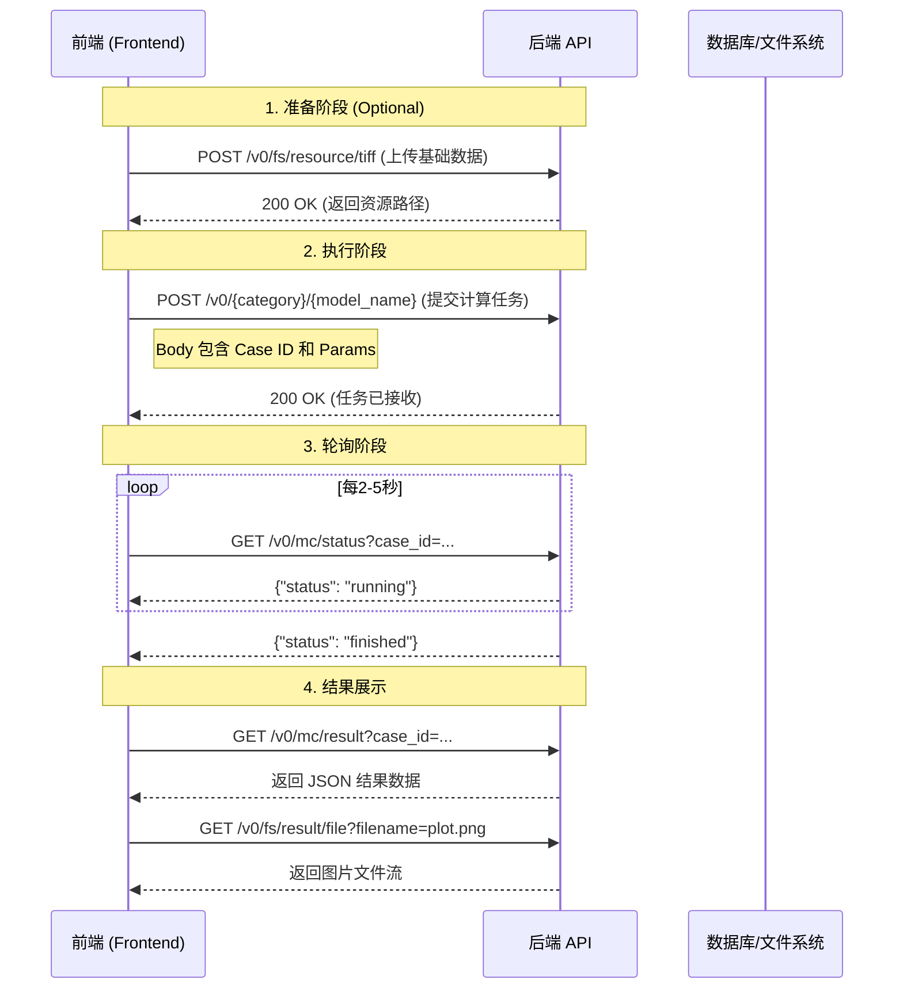

# 前端接口调用指南

本文档描述了如何通过 API 与 Bank Model Service (BMS) 进行交互，包括完整的调用流程、核心接口说明以及参数示例。

## 一、 调用流程概览

推荐的前端调用顺序如下：



---

## 二、 详细接口说明

### 1. 资源上传类 (File System)

用于在模型运行前上传所需的基础 GIS 数据（如地形、水动力场数据）。

#### 1.1 上传岸段数据 (GeoJSON)
*   **接口**: `POST /v0/fs/resource/geojson`
*   **Content-Type**: `multipart/form-data`
*   **说明**: 上传包含 `.geojson` 文件的压缩包。文件名必须与 json_data 中的 `name` 字段一致。
*   **请求参数**:
    *   `file`: (File, binary) - `.zip` 压缩包，解压后包含同名 `.geojson` 文件。
    *   `json_data`: (String, JSON) - 元数据描述。
        ```json
        {
            "segment": "长江中游", 
            "year": "2023", 
            "set": "base_data", 
            "name": "bank_segments"
        }
        ```
*   **响应**:
    ```json
    {
        "directory": "geojson/长江中游/2023/base_data/bank_segments/bank_segments.geojson"
    }
    ```

#### 1.2 上传 TIFF 文件 (地形/栅格)
*   **接口**: `POST /v0/fs/resource/tiff`
*   **Content-Type**: `multipart/form-data`
*   **请求参数**:
    *   `file`: (File, binary) - `.zip` 压缩包，内含 `.tiff` 文件。
    *   `json_data`: (String, JSON) - 元数据描述。
        ```json
        {
            "segment": "长江中游", 
            "year": "2023", 
            "set": "base_data", 
            "name": "elevation"
        }
        ```
*   **响应**:
    ```json
    {
        "directory": "tiff/长江中游/2023/base_data/elevation/elevation.tiff"
    }
    ```

#### 1.3 上传 ADF 文件 (ArcInfo Grid)
*   **接口**: `POST /v0/fs/resource/adf`
*   **Content-Type**: `multipart/form-data`
*   **请求参数**:
    *   `file`: (File, binary) - `.zip` 压缩包。
    *   `json_data`: (String, JSON)
*   **响应**: 返回文件存储相对路径。

#### 1.4 上传 Shapefile
*   **接口**: `POST /v0/fs/resource/shapefile`
*   **Content-Type**: `multipart/form-data`
*   **逻辑**: 上传 `.zip` 包，后端自动解压并校验 `.shp`, `.shx`, `.dbf`, `.prj` 是否完整。

---

### 2. 工作流模型控制类 (Bank Workflow)

这部分接口用于管理基于数据库的河道演变分析工作流，支持更细粒度的数据管理和修正。

#### 2.1 导入基础岸段数据
*   **接口**: `POST /v0/bank/workflows/import`
    *   *注意：代码中未直接展示此路径，但通常是 `routes.py` 将 `bank_workflow_service.import_bank_segments_from_geojson` 绑定到的路由。如果未找到，请检查 `routes.py` 中 `upload_bank_workflow_geojson` 对应的具体 URL。假设为通用上传接口的变体或新定义路径。*
    *   **根据代码 `app/main/routes.py` 补充**: 实际路由可能未在快照中完全显示，但 `upload_bank_workflow_geojson` 函数存在。建议使用前述的文件系统接口上传基础 geojson，或者确认后端是否开放了直接导入数据库的 `/bank/workflows/...` 接口。
    *   **修正**: 根据最新代码分析，存在 `POST` 接口用于导入。

#### 2.2 提交/更新修正线 (Submit Correction)
*   **场景**: 前端在地图上画线（例如护岸工程），并希望这条线影响后续的模型计算（如改变局部糙率）。
*   **接口**: `POST /v0/bank/workflows/{case_id}/corrections`
*   **Content-Type**: `application/json`
*   **请求 Body**:
    ```json
    {
        "correction_id": "optional-id", //如果不传则新建
        "description": "新建护岸工程",
        "geojson": {
            "type": "FeatureCollection",
            "features": [...] // 前端绘制的线要素
        },
        "correction_rules": {
            "roughness": 0.025, // 修正后的糙率
            "slope": 1.5
        }
    }
    ```
*   **响应**: 返回修正记录 ID。

#### 2.3 预览生效断面
*   **接口**: `GET /v0/bank/workflows/{case_id}/sections/effective`
*   **作用**: 在运行模型前，查看结合了基础数据和修正线后的最终计算断面参数。

#### 2.4 运行工作流计算
*   **接口**: `POST /v0/bank/workflows/{case_id}/run`
*   **请求 Body**:
    ```json
    {
        "clear_previous_results": true
    }
    ```

#### 2.5 获取工作流结果
*   **接口**: `GET /v0/bank/workflows/{case_id}/results`
*   **参数**: `limit` (默认 5000)

---

### 3. 通用模型控制类 (Model Runner)

核心计算接口，负责启动模型任务。

#### 3.1 启动模型
*   **接口**: `POST /v0/<category>/<model_name>`
    *   例如：`POST /v0/numerical/hydrodynamic` (水动力相关)
    *   例如：`POST /v0/re/section-view` (断面查看)
*   **Content-Type**: `application/json`
*   **请求 Body**:
    ```json
    {
        "caseId": "unique-uuid-string-12345",
        "features": {
            // 模型特定的 GIS 特征参数
        },
        "params": {
            "timeStep": 10,
            "roughness": 0.025
            // 其他计算参数
        }
    }
    ```
*   **响应**: `200 OK` 表示任务已进入后台队列。

---

### 4. 状态查询类 (Model Case Status)

由于计算耗时，前端需轮询此接口。

#### 4.1 获取任务状态
*   **接口**: `GET /v0/mc/status`
*   **请求参数**:
    *   `case_id`: (String) - 启动模型时使用的 ID。
*   **响应**:
    ```json
    {
        "status": "running" 
        // 可能值: "pending", "running", "finished", "error"
    }
    ```

#### 4.2 批量获取状态
*   **接口**: `POST /v0/mcs/status`
*   **Body**:
    ```json
    {
        "case_ids": ["id-1", "id-2"]
    }
    ```

---

### 5. 结果获取类 (Result Access)

当状态变为 `finished` 后调用。

#### 5.1 获取 JSON 结果
*   **接口**: `GET /v0/mc/result`
*   **请求参数**: `case_id`
*   **响应**: 防止大文件阻塞，通常返回关键指标或 GeoJSON 数据。

#### 5.2 获取结果文件
*   **接口**: `GET /v0/fs/result/file`
*   **请求参数**:
    *   `case_id`: 任务 ID。
    *   `filename`: 指定的文件名（如 `result.png`, `report.pdf`）。
*   **响应**: 二进制文件流。

#### 5.3 下载结果压缩包
*   **接口**: `GET /v0/fs/result/zip`
*   **请求参数**: `case_id`
*   **响应**: 包含该 Case 所有输出文件的 `.zip` 包。

#### 5.4 获取错误信息
*   **接口**: `GET /v0/mc/error`
*   **请求参数**: `case_id`
*   **适用场景**: 当状态为 `error` 时，查询具体报错堆栈或日志。

---

## 三、 使用示例 (JavaScript/Fetch)

```javascript
const API_BASE = 'http://localhost:8088/v0';
const caseId = crypto.randomUUID(); // 生成唯一ID

// 1. 启动模型
await fetch(`${API_BASE}/numerical/hydrodynamic`, {
    method: 'POST',
    headers: { 'Content-Type': 'application/json' },
    body: JSON.stringify({
        caseId: caseId,
        params: { mode: 'fast' }
    })
});

// 2. 轮询状态
const pollStatus = setInterval(async () => {
    const res = await fetch(`${API_BASE}/mc/status?case_id=${caseId}`);
    const data = await res.json();
    
    if (data.status === 'finished') {
        clearInterval(pollStatus);
        fetchResult();
    } else if (data.status === 'error') {
        clearInterval(pollStatus);
        console.error('Model failed');
    }
}, 3000);

// 3. 获取结果
async function fetchResult() {
    const res = await fetch(`${API_BASE}/mc/result?case_id=${caseId}`);
    const result = await res.json();
    console.log('Model Result:', result);
}
```
